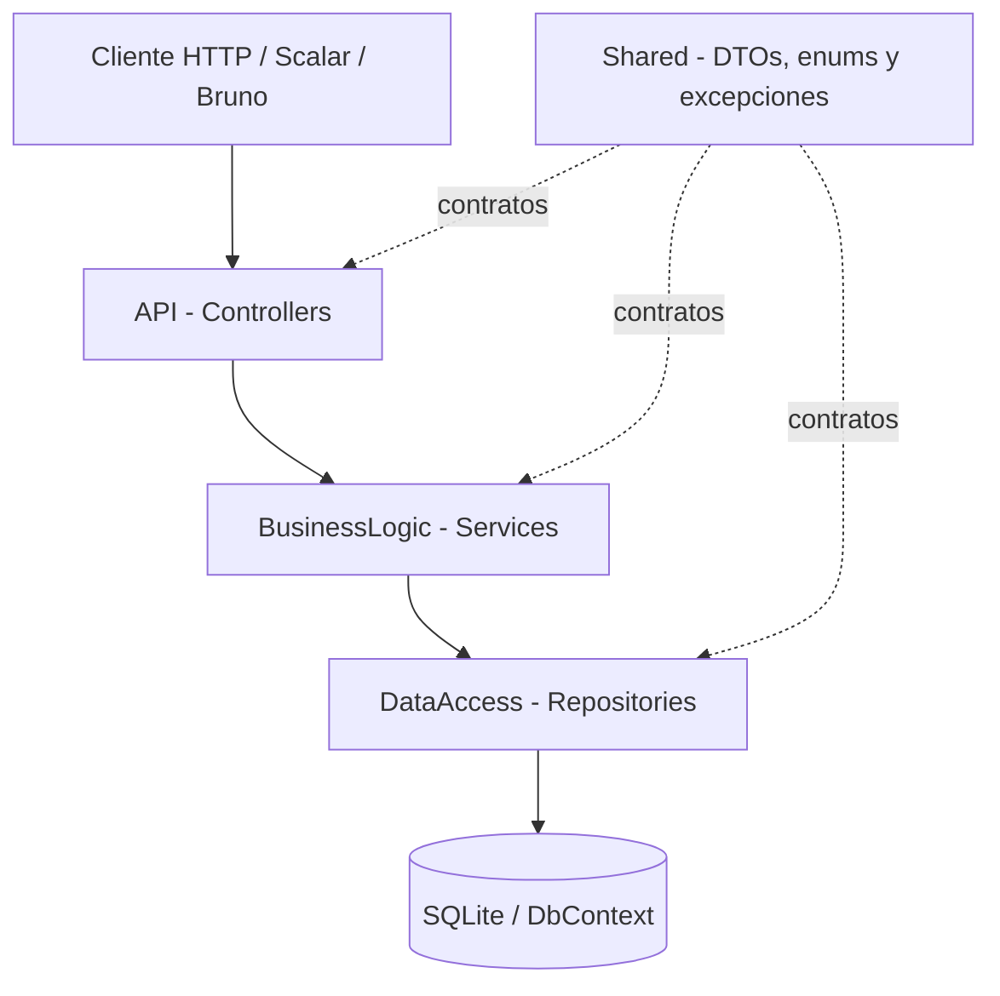

# Sistema de Turnos para Lavadero de Autos

Trabajo práctico del Grupo 9, desarrollado por Tomás Martín Ponce y Juan Jesús Baigorria.

API RESTful para administrar clientes, servicios de lavado, turnos y recordatorios. Los clientes pueden solicitar, modificar y cancelar únicamente sus propios turnos; los empleados y administradores pueden gestionar la agenda, y la administración mantiene el catálogo de servicios.

## Tecnologías

- .NET 10 y ASP.NET Core Web API.
- Entity Framework Core Code First con SQLite.
- Autenticación JWT y roles `Cliente`, `Empleado` y `Administrador`.
- Scalar/OpenAPI para documentación interactiva.
- xUnit y Moq para pruebas unitarias.
- `WebApplicationFactory` para pruebas de integración.
- Bruno para ejecutar requests manuales.

## Arquitectura N-Tier



El flujo obligatorio es `Controller → Service → Repository → DbContext`:

| Capa | Responsabilidad |
| --- | --- |
| `API/` | Recibe HTTP, valida DTOs, autentica con JWT y devuelve códigos de estado. |
| `BusinessLogic/` | Aplica permisos, reglas de negocio y mapeos manuales a DTOs. |
| `DataAccess/` | Ejecuta consultas y persistencia mediante repositorios y EF Core. |
| `Shared/` | Contiene DTOs, enums y excepciones tipadas compartidas. |
| `Migrations/` | Mantiene la migración inicial y el snapshot de EF Core. |
| `Tests/` | Contiene pruebas unitarias y de integración. |
| `bruno/` | Colección de requests para probar todos los endpoints. |

## Entidades principales

- `Cliente`: datos personales, contacto y preferencia de notificaciones.
- `Servicio`: nombre, importe y estado activo.
- `Turno`: cliente, servicio, fecha, estado y fecha de creación.
- Entidades de apoyo: `Usuario` para autenticación y `Recordatorio` para registrar los avisos procesados.

## Reglas de negocio principales

- Un horario solo admite un turno confirmado.
- Las fechas de los turnos deben ser futuras.
- Un cliente solo puede crear, modificar, consultar y cancelar sus propios turnos.
- Empleados y administradores pueden crear turnos para clientes y consultar la agenda.
- Solo un administrador puede crear, modificar o eliminar servicios.
- Un servicio con turnos relacionados no puede eliminarse.
- Los recordatorios no se repiten para un mismo turno y respetan la preferencia del cliente.
- Las consultas de solo lectura usan `AsNoTracking()` y las relaciones aplican `DeleteBehavior.Restrict`.

La especificación completa está en [Reglas de Negocio](Documentos/Entregas%20TP/Reglas%20de%20Negocio.md) y [Casos de Uso](Documentos/Entregas%20TP/).

## Ejecutar el proyecto

Requisitos: SDK de .NET 10 y, opcionalmente, Bruno.

Desde la raíz del repositorio:

```powershell
dotnet restore TurnosLavadero.slnx
dotnet build TurnosLavadero.slnx
dotnet test TurnosLavadero.slnx
```

Para disponer de un administrador de demostración en la base local, definir las variables antes del primer arranque:

```powershell
$env:TURNOSLAVADERO_SEED_ADMIN_EMAIL = "admin@lavadero.local"
$env:TURNOSLAVADERO_SEED_ADMIN_PASSWORD = "Admin123!"
dotnet run --project API
```

La API aplica automáticamente las migraciones y carga datos de ejemplo. En desarrollo se ejecuta en `http://localhost:5088` y Scalar queda disponible en:

- `http://localhost:5088/scalar/v1`
- Documento OpenAPI: `http://localhost:5088/openapi/v1.json`

La clave JWT incluida en `appsettings.json` es exclusivamente para desarrollo. En producción debe reemplazarse mediante configuración segura.

## Autenticación

Registrar un cliente:

```http
POST /api/auth/registro
Content-Type: application/json

{
  "nombre": "Juan",
  "apellido": "Prueba",
  "email": "juan.prueba@example.test",
  "password": "ClaveSegura123",
  "telefono": "+54 3493 123456"
}
```

Iniciar sesión:

```http
POST /api/auth/login
Content-Type: application/json

{
  "email": "admin@lavadero.local",
  "password": "Admin123!"
}
```

Respuesta resumida:

```json
{
  "token": "eyJ...",
  "expiraEn": "2026-09-18T18:00:00Z",
  "usuarioId": "00000000-0000-0000-0000-000000000000",
  "clienteId": null,
  "email": "admin@lavadero.local",
  "rol": "Administrador"
}
```

Para los endpoints protegidos se envía `Authorization: Bearer <token>`.

## Catálogo de endpoints

| Método | Ruta | Acceso | Resultado esperado |
| --- | --- | --- | --- |
| `POST` | `/api/auth/registro` | Público | Registra un cliente y devuelve `201`. |
| `POST` | `/api/auth/login` | Público | Valida credenciales y devuelve el JWT. |
| `GET` | `/api/clientes` | Empleado/Admin | Lista los clientes. |
| `GET` | `/api/clientes/{id}` | Propio cliente/Personal | Obtiene un cliente. |
| `POST` | `/api/clientes` | Empleado/Admin | Crea un cliente y devuelve `201`. |
| `PUT` | `/api/clientes/{id}` | Propio cliente/Personal | Actualiza datos permitidos. |
| `GET` | `/api/servicios` | Autenticado | Lista servicios activos. |
| `GET` | `/api/servicios/{id}` | Autenticado | Obtiene un servicio. |
| `POST` | `/api/servicios` | Admin | Crea un servicio y devuelve `201`. |
| `PUT` | `/api/servicios/{id}` | Admin | Actualiza un servicio. |
| `DELETE` | `/api/servicios/{id}` | Admin | Elimina un servicio sin dependencias (`204`). |
| `GET` | `/api/turnos/mis-turnos` | Cliente | Lista los turnos propios. |
| `GET` | `/api/turnos/agenda?fecha=AAAA-MM-DD` | Empleado/Admin | Consulta la agenda diaria. |
| `GET` | `/api/turnos/disponibilidad?fechaHora=...` | Autenticado | Indica si el horario está disponible. |
| `POST` | `/api/turnos` | Autenticado | Crea un turno y devuelve `201`. |
| `PUT` | `/api/turnos/{id}` | Propietario/Personal | Modifica un turno activo. |
| `DELETE` | `/api/turnos/{id}` | Propietario/Personal | Cancela el turno y devuelve `204`. |
| `POST` | `/api/recordatorios/procesar?desde=...&hasta=...` | Admin | Procesa recordatorios del período. |

Ejemplo de creación de turno:

```json
{
  "clienteId": "11111111-1111-1111-1111-111111111111",
  "servicioId": "22222222-2222-2222-2222-222222222222",
  "fechaHora": "2026-12-10T15:00:00-03:00"
}
```

Si el usuario tiene rol `Cliente`, `clienteId` puede omitirse: el sistema toma el identificador incluido en el JWT y rechaza intentos de operar sobre otro cliente.

## Códigos HTTP y errores

Los controllers traducen explícitamente las excepciones tipadas:

| Código | Uso |
| --- | --- |
| `200 OK` | Consulta o actualización correcta. |
| `201 Created` | Registro creado. |
| `204 No Content` | Eliminación o cancelación correcta. |
| `400 Bad Request` | DTO o datos de entrada inválidos. |
| `401 Unauthorized` | Token ausente/inválido o credenciales incorrectas. |
| `403 Forbidden` | El rol o propietario no tiene permiso. |
| `404 Not Found` | Cliente, servicio o turno inexistente. |
| `409 Conflict` | Duplicado, horario ocupado o dependencia de negocio. |

## Pruebas

```powershell
dotnet test TurnosLavadero.slnx
```

La solución incluye 29 pruebas:

- 25 unitarias sobre servicios, aisladas con Moq y sin base real.
- 4 de integración sobre endpoints con `WebApplicationFactory` y una base SQLite temporal.

## Bruno

Abrir la carpeta `bruno/` como colección y seleccionar el ambiente `Local`. La colección contiene un request por endpoint y ejemplos de errores `400`, `404` y `409`. El login de administrador usa las credenciales de demostración indicadas anteriormente y guarda automáticamente el token.

## Documentación del análisis

- [Alcance del sistema](Documentos/Entregas%20TP/Alcance%20del%20Sistema.md)
- [Reglas de negocio](Documentos/Entregas%20TP/Reglas%20de%20Negocio.md)
- [Casos de uso](Documentos/Entregas%20TP/)
- [Plan de arquitectura](PLAN-ARQUITECTURA.md)
- [Documento compartido](https://docs.google.com/document/d/1u6gnrypKfr5JKO2foNjE4LByljXXXwsm/edit?usp=sharing)
- [Mockup en Excalidraw](https://excalidraw.com/#room=4c555b22d46d1dd52a49,qfMk6W81Y5vJPTPZ82flhQ)
